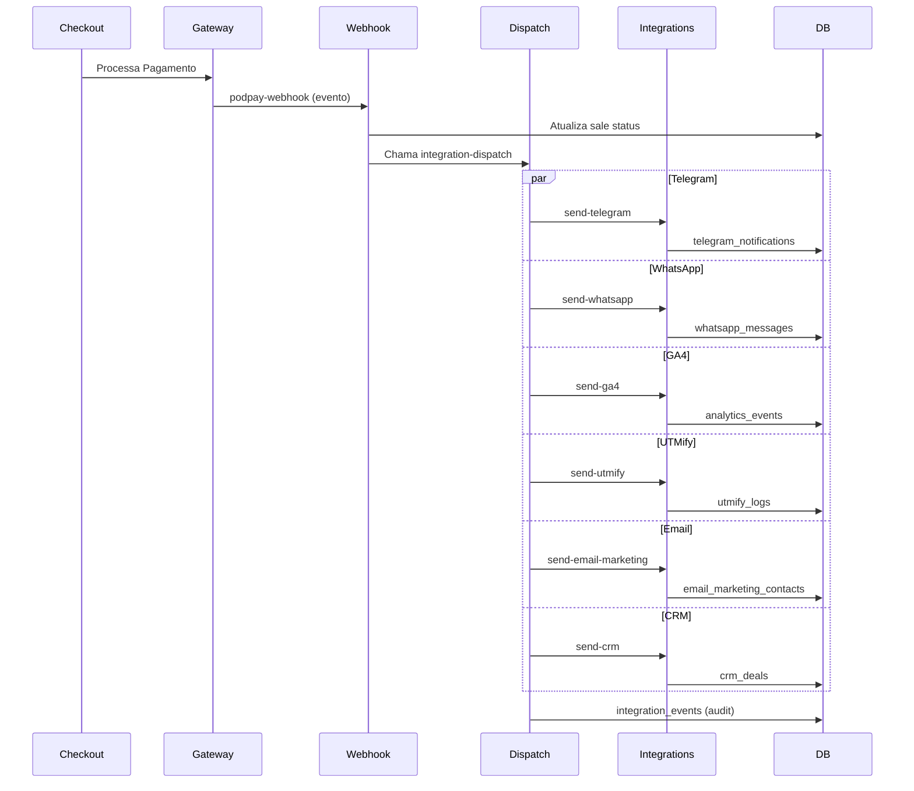

# 📚 Documentação Técnica de Integrações

## Arquitetura Completa do Sistema de Integrações

Este documento descreve a arquitetura, fluxos, payloads e checklist de validação para todas as integrações do gateway de pagamento.

---

## 📊 Visão Geral da Arquitetura

```
┌─────────────────────────────────────────────────────────────────────┐
│                        FRONTEND (React)                             │
│  ┌──────────────┐  ┌──────────────┐  ┌──────────────┐              │
│  │ UTM Tracking │  │   Checkout   │  │  Dashboard   │              │
│  │    Hook      │  │    Form      │  │ Integrações  │              │
│  └──────────────┘  └──────────────┘  └──────────────┘              │
└─────────────────────────────────────────────────────────────────────┘
                              │
                              ▼
┌─────────────────────────────────────────────────────────────────────┐
│                     SUPABASE EDGE FUNCTIONS                         │
│                                                                     │
│  ┌─────────────────────────────────────────────────────────────┐   │
│  │              integration-dispatch (Orquestrador)              │   │
│  │   • Recebe eventos de pagamento                              │   │
│  │   • Busca integrações do usuário                             │   │
│  │   • Dispara para cada provedor configurado                   │   │
│  │   • Retry com backoff exponencial                            │   │
│  └─────────────────────────────────────────────────────────────┘   │
│                              │                                      │
│         ┌────────────────────┼────────────────────┐                │
│         ▼                    ▼                    ▼                │
│  ┌────────────┐      ┌────────────┐      ┌────────────┐           │
│  │send-telegram│      │  send-ga4  │      │send-utmify │           │
│  └────────────┘      └────────────┘      └────────────┘           │
│  ┌────────────┐      ┌────────────┐      ┌────────────┐           │
│  │send-whatsapp│     │send-email- │      │  send-crm  │           │
│  │            │      │ marketing  │      │            │           │
│  └────────────┘      └────────────┘      └────────────┘           │
└─────────────────────────────────────────────────────────────────────┘
                              │
                              ▼
┌─────────────────────────────────────────────────────────────────────┐
│                      BANCO DE DADOS (Supabase)                      │
│                                                                     │
│  ┌─────────────────┐  ┌─────────────────┐  ┌─────────────────┐    │
│  │ user_integrations│  │  webhook_logs   │  │integration_events│   │
│  └─────────────────┘  └─────────────────┘  └─────────────────┘    │
│  ┌─────────────────┐  ┌─────────────────┐  ┌─────────────────┐    │
│  │telegram_notifs  │  │whatsapp_messages│  │ analytics_events │   │
│  └─────────────────┘  └─────────────────┘  └─────────────────┘    │
│  ┌─────────────────┐  ┌─────────────────┐  ┌─────────────────┐    │
│  │email_marketing_ │  │   crm_deals     │  │ zapier_triggers  │   │
│  │   contacts      │  │                 │  │                  │   │
│  └─────────────────┘  └─────────────────┘  └─────────────────┘    │
└─────────────────────────────────────────────────────────────────────┘
```

---

## 🔄 Fluxo Completo de Eventos

### Fluxo de Pagamento → Integrações



---

## 📦 Estrutura de Payloads

### 1. Payload do Evento de Integração (integration-dispatch)

```json
{
  "event_type": "payment.approved",
  "user_id": "uuid-do-vendedor",
  "sale_id": "uuid-da-venda",
  "product_id": "uuid-do-produto",
  "transaction_id": "TXN123456",
  "customer_email": "cliente@email.com",
  "customer_name": "Nome do Cliente",
  "customer_phone": "5511999999999",
  "amount": 197.00,
  "currency": "BRL",
  "payment_method": "credit_card",
  "metadata": {
    "utm_source": "facebook",
    "utm_medium": "cpc",
    "utm_campaign": "lancamento",
    "client_id": "GA1.2.1234567890.1234567890",
    "ip_address": "177.100.200.50"
  }
}
```

### 2. Payload para UTMify

```json
{
  "orderId": "sale_uuid",
  "platform": "royalpay",
  "paymentMethod": "CreditCard",
  "status": "Paid",
  "createdAt": "2025-01-07T15:30:00.000Z",
  "approvedDate": "2025-01-07T15:30:05.000Z",
  "refundedAt": null,
  "customer": {
    "name": "Nome do Cliente",
    "email": "cliente@email.com",
    "phone": "5511999999999",
    "document": "12345678900",
    "country": "BR"
  },
  "products": [{
    "id": "product_uuid",
    "name": "Nome do Produto",
    "planId": null,
    "planName": null,
    "quantity": 1,
    "priceInCents": 19700
  }],
  "trackingParameters": {
    "src": "facebook",
    "utm_source": "facebook",
    "utm_medium": "cpc",
    "utm_campaign": "lancamento",
    "utm_content": "video1",
    "utm_term": "curso online"
  },
  "commission": {
    "totalPriceInCents": 19700,
    "gatewayFeeInCents": 788,
    "userCommissionInCents": 18912
  }
}
```

### 3. Payload para GA4 (Measurement Protocol)

```json
{
  "client_id": "GA1.2.1234567890.1234567890",
  "events": [{
    "name": "purchase",
    "params": {
      "transaction_id": "TXN123456",
      "value": 197.00,
      "currency": "BRL",
      "items": [{
        "item_id": "product_uuid",
        "item_name": "Nome do Produto",
        "price": 197.00,
        "quantity": 1
      }]
    }
  }]
}
```

### 4. Payload para Webhook Externo

```json
{
  "event": "payment.approved",
  "timestamp": "2025-01-07T15:30:05.000Z",
  "data": {
    "sale_id": "uuid",
    "transaction_id": "TXN123456",
    "amount": 197.00,
    "currency": "BRL",
    "payment_method": "credit_card",
    "customer": {
      "name": "Nome do Cliente",
      "email": "cliente@email.com",
      "phone": "5511999999999"
    },
    "product": {
      "id": "product_uuid",
      "name": "Nome do Produto"
    },
    "utm": {
      "source": "facebook",
      "medium": "cpc",
      "campaign": "lancamento"
    }
  },
  "signature": "sha256=abc123def456..."
}
```

### 5. Payload para Telegram

```markdown
✅ *PAYMENT APPROVED*

💰 *Valor:* R$ 197,00
📧 *Cliente:* cliente@email.com
👤 *Nome:* Nome do Cliente
💳 *Método:* Cartão de Crédito
🔢 *Transação:* `TXN123456`
📅 *Data:* 07/01/2025 12:30:05
```

---

## 🔐 Segurança

### HMAC Signature (Webhooks)

```typescript
// Geração da assinatura
const signature = crypto
  .createHmac('sha256', webhookSecret)
  .update(JSON.stringify(payload))
  .digest('hex');

// Header enviado
headers['X-Webhook-Signature'] = `sha256=${signature}`;

// Validação no destino
const isValid = crypto.timingSafeEqual(
  Buffer.from(receivedSignature),
  Buffer.from(`sha256=${computedSignature}`)
);
```

### Idempotência

Todas as integrações usam chaves de idempotência para evitar duplicação:

```sql
-- Exemplo: analytics_events
deduplication_key = '{sale_id}_{event_type}'

-- Exemplo: webhook_logs  
idempotency_key = '{sale_id}_{event_type}'
```

### Retry com Backoff Exponencial

```typescript
const retryPolicy = {
  max_retries: 3,
  initial_delay_ms: 1000,
  backoff_multiplier: 2,
  // Delays: 1s, 2s, 4s
};
```

---

## 📋 Checklist de Validação

### ✅ Captura de UTMs (Frontend)

- [ ] UTMs capturadas da URL no primeiro acesso
- [ ] UTMs persistidas em localStorage E cookies
- [ ] UTMs não sobrescritas ao navegar
- [ ] UTMs enviadas no payload do checkout
- [ ] Fallback para valores vazios (não undefined)

### ✅ Banco de Dados

- [ ] Tabela `utm_tracking` recebe dados corretamente
- [ ] Associação sale_id preenchida após pagamento
- [ ] Dados imutáveis após `utmify_sent = true`
- [ ] RLS habilitado em todas as tabelas
- [ ] Índices criados para queries frequentes

### ✅ Webhook Nativo

- [ ] Endpoint responde em < 5 segundos
- [ ] Retorna status 2xx para sucesso
- [ ] Assinatura HMAC validada
- [ ] Retry automático em falhas
- [ ] Logs completos em `webhook_logs`

### ✅ Telegram

- [ ] Bot criado e token válido
- [ ] Chat ID correto (grupo ou usuário)
- [ ] Mensagens formatadas em Markdown
- [ ] Logs em `telegram_notifications`
- [ ] Eventos configurados corretamente

### ✅ WhatsApp Cloud API

- [ ] Access Token válido e não expirado
- [ ] Phone Number ID correto
- [ ] Template aprovado pelo WhatsApp
- [ ] Número do destinatário formatado (5511...)
- [ ] Logs em `whatsapp_messages`

### ✅ Google Analytics 4

- [ ] Measurement ID no formato G-XXXXXXXX
- [ ] API Secret gerado no GA4 Admin
- [ ] Eventos aparecem no Debug View
- [ ] Deduplicação funcionando
- [ ] Conversões registradas corretamente

### ✅ UTMify

- [ ] Token API válido
- [ ] Payload conforme documentação
- [ ] Conversão aparece no painel UTMify
- [ ] Valor e UTMs correspondem
- [ ] Flag `utmify_sent` atualizada

### ✅ Email Marketing

- [ ] API Key do provedor válida
- [ ] Lista de contatos existe
- [ ] Contatos criados/atualizados
- [ ] Tags aplicadas corretamente
- [ ] Duplicatas tratadas

### ✅ CRM (HubSpot/Pipedrive)

- [ ] Token de acesso válido
- [ ] Pipeline ID correto
- [ ] Contato criado ou encontrado
- [ ] Deal criado com valor correto
- [ ] Associação contato-deal feita

### ✅ Zapier

- [ ] Webhook URL válida
- [ ] Eventos selecionados
- [ ] Payload recebido no Zap
- [ ] Trigger count incrementando
- [ ] Erros logados

---

## 🛠️ Troubleshooting

### Problema: Webhook não entrega

1. Verificar URL acessível externamente
2. Checar timeout (máximo 30s)
3. Validar certificado SSL
4. Revisar logs em `webhook_logs`

### Problema: UTMs perdidas

1. Verificar hook `useUtmTracking` no checkout
2. Checar localStorage/cookies
3. Confirmar envio no payload do checkout
4. Revisar `utm_tracking` table

### Problema: GA4 não recebe eventos

1. Validar Measurement ID e API Secret
2. Testar no GA4 Debug View
3. Checar deduplicação (mesmo evento já enviado?)
4. Revisar `analytics_events` table

### Problema: Telegram não notifica

1. Validar token do bot
2. Verificar se bot foi adicionado ao grupo
3. Checar Chat ID (usar @userinfobot)
4. Revisar permissões do bot

---

## 📈 Métricas e Monitoramento

### Queries Úteis

```sql
-- Taxa de sucesso de webhooks (últimas 24h)
SELECT 
  COUNT(*) FILTER (WHERE delivered_at IS NOT NULL) as delivered,
  COUNT(*) FILTER (WHERE failed_at IS NOT NULL) as failed,
  COUNT(*) as total,
  ROUND(100.0 * COUNT(*) FILTER (WHERE delivered_at IS NOT NULL) / COUNT(*), 2) as success_rate
FROM webhook_logs
WHERE created_at > NOW() - INTERVAL '24 hours';

-- Integrações com mais erros
SELECT 
  integration_id,
  SUM(error_count) as total_errors,
  MAX(last_error) as last_error
FROM user_integrations
WHERE error_count > 0
GROUP BY integration_id
ORDER BY total_errors DESC;

-- Conversões UTMify por source
SELECT 
  utm_source,
  COUNT(*) as conversions,
  SUM(amount) as total_value
FROM utm_tracking ut
JOIN sales s ON ut.sale_id = s.id
WHERE s.status = 'paid' AND ut.utmify_sent = true
GROUP BY utm_source
ORDER BY total_value DESC;
```

---

## 🚀 Próximas Melhorias

1. **Rate Limiting**: Implementar controle de taxa para APIs externas
2. **Circuit Breaker**: Desabilitar temporariamente integrações com muitas falhas
3. **Dashboard de Métricas**: Visualização em tempo real de entregas
4. **Webhooks Bidirecionais**: Receber status de entrega de provedores
5. **Filas Distribuídas**: Migrar para sistema de filas (ex: BullMQ)
6. **Alertas Automáticos**: Notificar vendedor sobre falhas críticas
